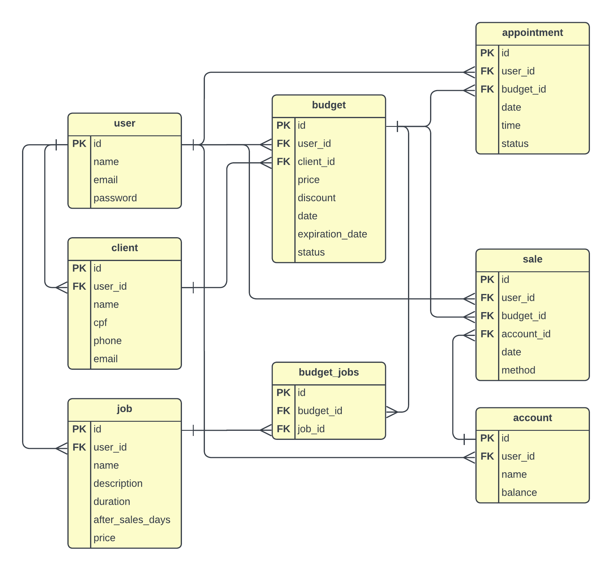

## Como usar

Crie um banco de dados Postgres e um arquivo `.env` na raiz do projeto, dentro desse arquivo preencha com as informações do seu banco de dados no seguinte modelo:

```
PORT=8080
CONNECTION_STRING="user=seu_usuario password=sua_senha host=seu_host port=5432 dbname=seu_banco sslmode=disable"
TEST_CONNECTION_STRING="user=seu_usuario password=sua_senha host=seu_host port=5432 dbname=seu_banco sslmode=disable"
SECRET=sua_chave
```

**OBS:** O campo `SECRET` é usado para gerar os tokens [JWT](https://https://jwt.io/), pode preencher com uma string aleatória, mas lembre-se de criar uma string forte caso vá usar o projeto em produção.

Feito isso, dentro do terminal na pasta do projeto você pode executar os seguintes comando para testar ou executar a aplicação respectivamente:

```
$ go test ./...
$ go run ./cmd/main.go
```

## Diagrama do banco de dados


