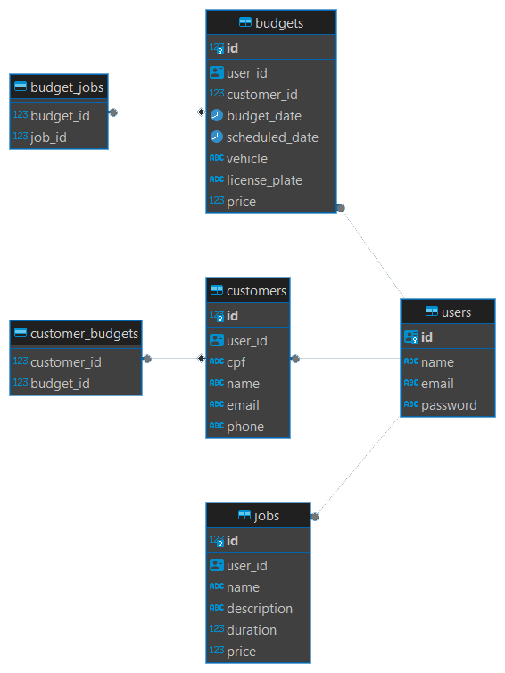

## Passo 1: Configuração do banco de dados

**1.1.** Crie um banco de dados Postgres.

**1.2.** Crie um arquivo .env na raiz do projeto.

**1.3.** Preencha o arquivo .env com as informações do banco de dados no seguinte modelo:

```
PORT=8080
CONNECTION_STRING="user=seu_usuario password=sua_senha host=seu_host port=5432 dbname=seu_banco sslmode=disable"
TEST_CONNECTION_STRING="user=seu_usuario password=sua_senha host=seu_host port=5432 dbname=seu_banco sslmode=disable"
SECRET=sua_chave
```

**Observação:** O campo SECRET é usado para gerar tokens JWT. Preencha com uma string aleatória, mas crie uma string forte se o projeto for usado em produção.

## Passo 2: Executar a aplicação

**3.1.** No terminal, na pasta do projeto, use o seguinte comando para executar a aplicação:

```
$ go run ./cmd/main.go
```

## Diagrama do banco de dados


